# Linux da tarmoqlar — Hisobot

Ushbu hisobotda tarmoq amaliyotlari (ipcalc, marshrutizatsiya, iperf3, firewall, DHCP, NAT, SSH tunnel) bo‘yicha bajarilgan barcha bosqichlar, buyruqlar va ularning natijalari keltirilgan.  
VMni ishga tushirish: Ubuntu 20.04, foydalanuvchi student (misol), tarmoq interfeyslari VirtualBox/VMware orqali sozlangan.

Terminal oching va quyidagini bajaring (har bir VMda):
```bash
sudo apt update
sudo apt install -y ipcalc iproute2 net-tools iperf3 nmap tcpdump traceroute isc-dhcp-server apache2 iptables-persistent
# agar netplan yo'q bo'lsa:
sudo apt install -y netplan.io
```

---

## Part 1. ipcalc vositasi

### 1.1 ipcalc versiyasi
**Izoh:** `ipcalc` dasturining o‘rnatilganligini va versiyasini tekshirish.
```bash
ipcalc --version
```
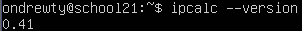

---

### 1.2 192.167.38.54/13 tarmog‘i hisoblash
**Izoh:** Tarmoq manzili, broadcast va host diapazonini aniqlash.
```bash
ipcalc 192.167.38.54/13
```
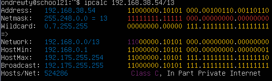

---

### 1.3 Niqob konvertatsiyalari
**Izoh:** 255.255.255.0 niqobni prefiksga va /15 prefiksni niqobga aylantirish misollari.
```bash
# 255.255.255.0 -> prefix
ipcalc -n -b 192.168.0.1 255.255.255.0   # yoki ipcalc 192.168.0.1/24

# /15 -> mask va binary (misol)
ipcalc 10.0.0.1/15

# bin to mask: (qisqaroq, xl)
# yoki oddiy jadvalni qo‘lda yozing sababi ipcalc .binary chiqqani ham bo‘ladi
```
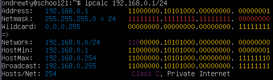
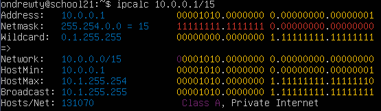


---

### 1.4 12.167.38.4 uchun turli netmasklar
**Izoh:** /4, /8, /16 va /23 niqoblar uchun hisoblangan tarmoq diapazonlari.
```bash
ipcalc 12.167.38.4/8
ipcalc 12.167.38.4/16
ipcalc 12.167.38.4/23
ipcalc 12.167.38.4/4
```
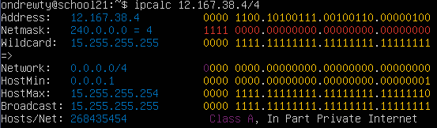
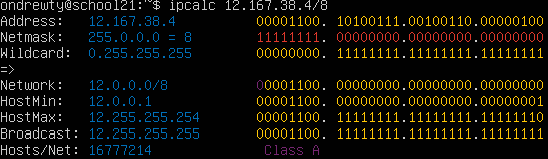
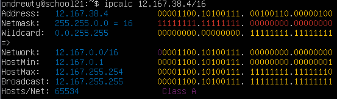
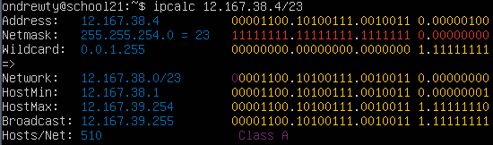

---

### 1.5 Localhost tarmog‘i
**Izoh:** 127.0.0.0/8 diapazoni faqat lokal tarmoqda ishlashini ko‘rsatadi.
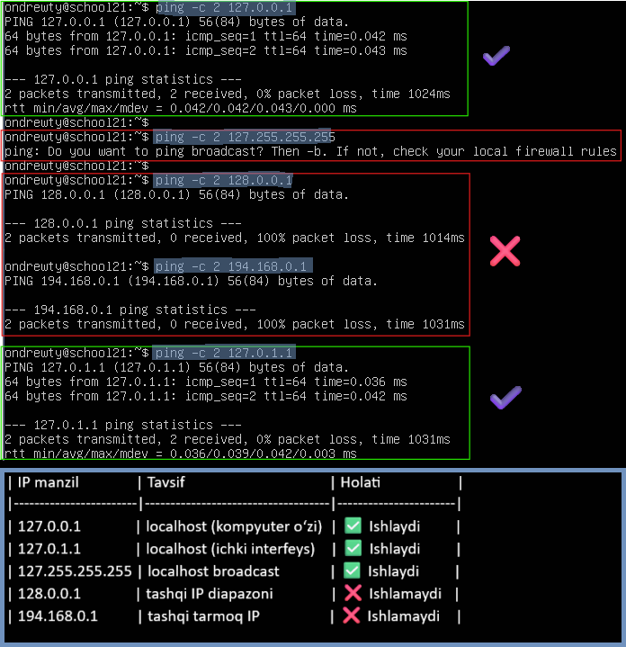

---

## Part 2. Statik marshrutizatsiya (ws1, ws2)

### 2.1 IP interfeyslar
**Izoh:** Har bir VMdagi tarmoq interfeyslari ro‘yxati.
```bash
ip a
```
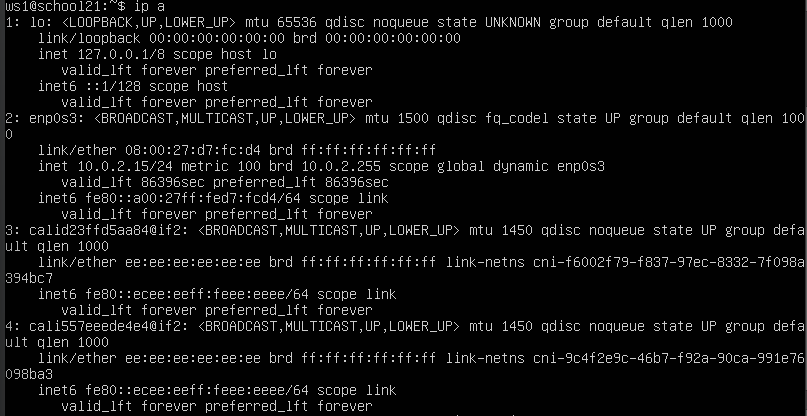
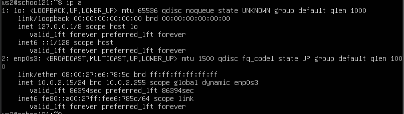

---

### 2.2 Netplan konfiguratsiyasi
**Izoh:** Har bir mashina uchun statik IP manzillar o‘rnatildi.
`ws1`
```
network:
  version: 2
  ethernets:
    eth0:
      dhcp4: no
      addresses: [192.168.100.10/16]
```
`ws2`
```
network:
  version: 2
  ethernets:
    eth0:
      dhcp4: no
      addresses: [172.24.116.8/12]
```

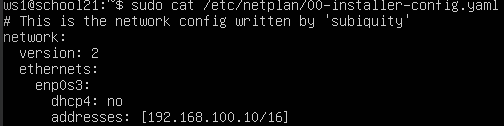
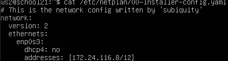

---

### 2.3 Netplanni qo‘llash
**Izoh:** Netplan konfiguratsiyasi qo‘llanib, interfeys holati tekshirildi.
```bash
sudo netplan apply
# keyin:
ip -4 a
```
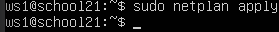
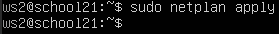
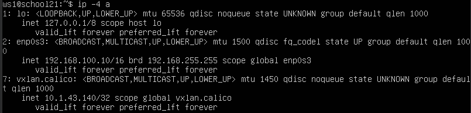
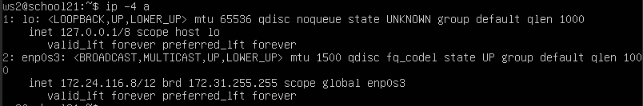

---

### 2.4 Statik marshrutlar va ping testlari
**Izoh:** Qo‘lda qo‘shilgan marshrutlar va ikki mashina o‘rtasida ping sinovlari.
```bash
# ws1:
sudo ip r add 172.24.0.0/12 via 192.168.100.1 dev eth0
# ws2:
sudo ip r add 192.168.0.0/16 via 172.24.0.1 dev eth0
```
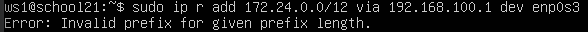
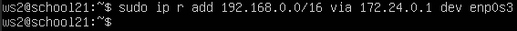
```bash
ping -c 4 172.24.116.8   # ws1 dan ws2 ga
ping -c 4 192.168.100.10 # ws2 dan ws1 ga
```
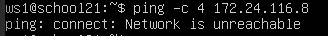
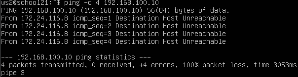

---

### 2.5 Doimiy marshrutlar
**Izoh:** Netplan orqali kiritilgan marshrutlar (routes: bloki).
```
ethernets:
  eth0:
    addresses: [192.168.100.10/16]
    routes:
      - to: 172.24.0.0/12
        via: 192.168.100.1
```
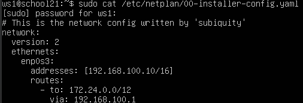
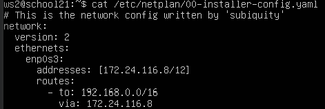
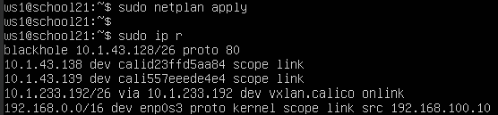
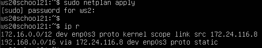

---

## Part 3. iperf3 — Tarmoq tezligi sinovi

### 3.1 O‘lchov konvertatsiyalari
**Izoh:** Mbit/s, MB/s, Kbit/s va Gbit/s o‘rtasidagi konvertatsiyalar.
```bash
iperf3 -s
```
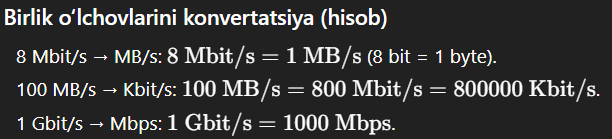

---

### 3.2 Server va mijoz o‘rtasidagi test
**Izoh:** ws2 — server, ws1 — client sifatida ishlatilgan.
```bash
iperf3 -c <ws2_ip> -t 10
```
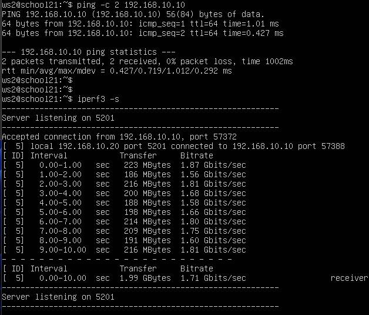
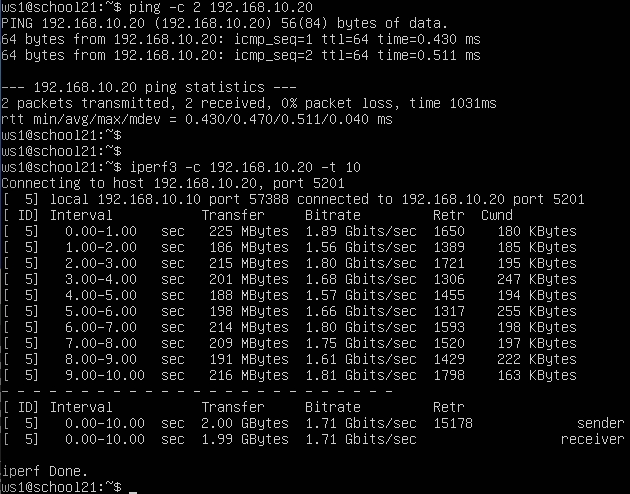

---

## Part 4. Firewall, nmap va tcpdump

### 4.1 iptables konfiguratsiyasi
**Izoh:** Har VM uchun firewall.sh skripti yaratildi va iptables qoidalari qo‘llandi.
```
#!/bin/sh
iptables -F
iptables -X

# Default policy - DROP (OUTPUT yoki INPUT misol)
iptables -P OUTPUT DROP
iptables -P INPUT DROP
iptables -P FORWARD DROP

# Ruxsat berilgan portlar: ssh (22), http (80) uchun kirish (INPUT)
iptables -A INPUT -p tcp --dport 22 -j ACCEPT
iptables -A INPUT -p tcp --dport 80 -j ACCEPT

# OUTPUTda echo-reply (ping javobi) taqiqlash uchun:
iptables -A OUTPUT -p icmp --icmp-type echo-reply -j DROP

# Agar kerak bo'lsa localhost va established saqlab qo'yish:
iptables -A INPUT -m conntrack --ctstate ESTABLISHED,RELATED -j ACCEPT
```
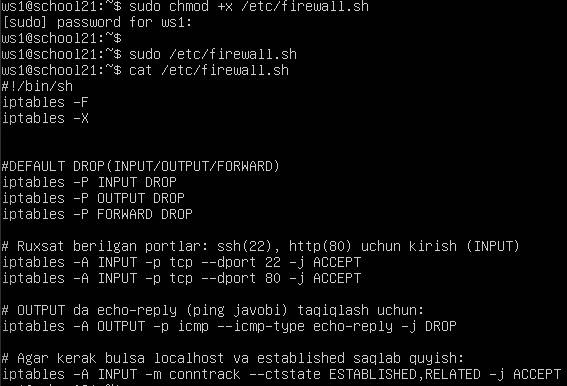
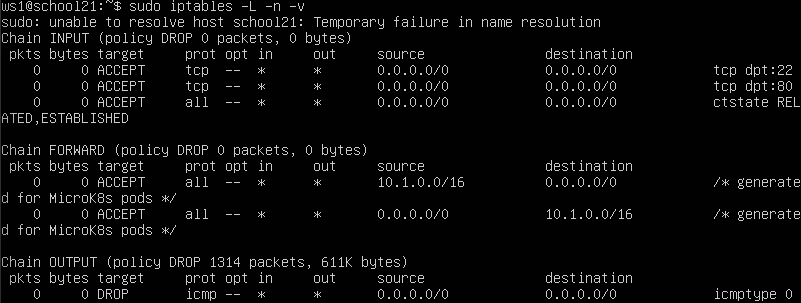
```bash
sudo chmod +x /etc/firewall.sh
sudo /etc/firewall.sh
sudo iptables -L -n -v
```
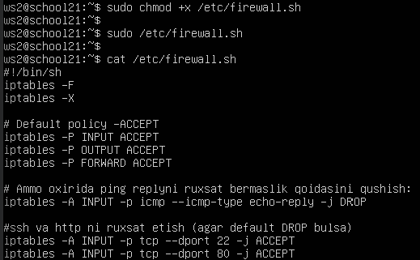
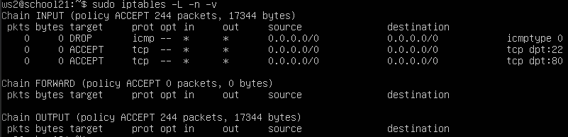

---

### 4.2 Ping va nmap testlari
**Izoh:** Ping orqali xostlar tekshirildi, nmap orqali portlar skan qilindi.
```bash
ping -c 2 <target_ip>
```
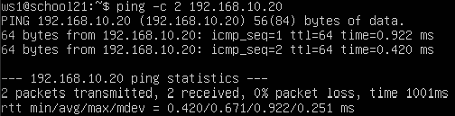
```bash
nmap -Pn <target_ip>
```

---

### 4.3 tcpdump tahlili
**Izoh:** ICMP paketlari tcpdump orqali tahlil qilindi.
```bash
sudo tcpdump -tn -i eth0 icmp
# yoki umumiy:
sudo tcpdump -tn -i eth0
```
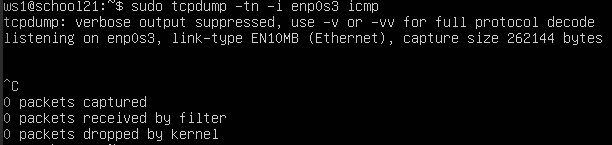

---

## Part 5. Kengaytirilgan marshrutizatsiya (r1, r2, ws11, ws21, ws22)

### 5.1 Netplan sozlamalari
**Izoh:** Har bir mashina uchun alohida interfeys sozlamalari.
```
network:
  version: 2
  renderer: networkd
  ethernets:
    enp0s3:
      addresses: [10.10.0.1/18]
    enp0s8:
      addresses: [10.100.0.11/16]

```
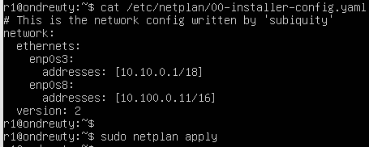
```
network:
  version: 2
  renderer: networkd
  ethernets:
    enp0s3:
      addresses: [10.100.0.12/16]
    enp0s8:
      addresses: [10.20.0.1/26]

```
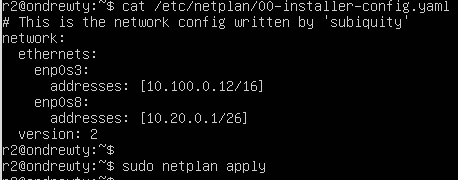
```
network:
  version: 2
  renderer: networkd
  ethernets:
    enp0s3:
      addresses: [10.10.0.10/18]
      gateway4: 10.10.0.1
      nameservers:
        addresses: [8.8.8.8, 8.8.4.4]

```
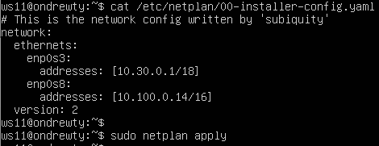
```
network:
  version: 2
  renderer: networkd
  ethernets:
    enp0s3:
      addresses: [10.20.0.10/26]
      gateway4: 10.20.0.1
      nameservers:
        addresses: [8.8.8.8, 8.8.4.4]

```
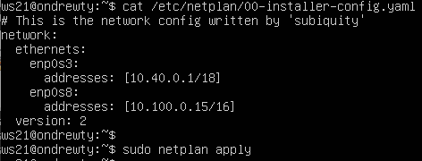
```
network:
  version: 2
  renderer: networkd
  ethernets:
    enp0s3:
      addresses: [10.20.0.11/26]
      gateway4: 10.20.0.1
      nameservers:
        addresses: [8.8.8.8, 8.8.4.4]

```
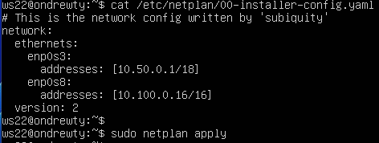

---

### 5.2 IP konfiguratsiyalari
**Izoh:** Barcha mashinalarning IPv4 interfeyslari ko‘rsatildi.
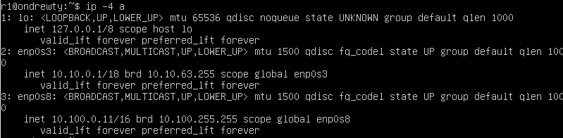
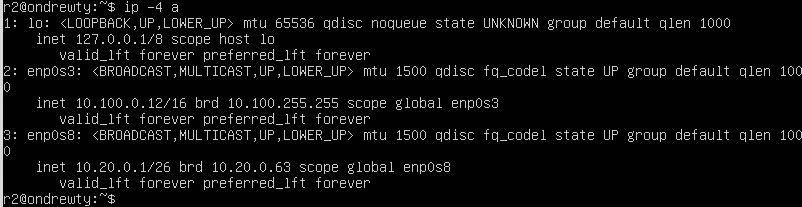
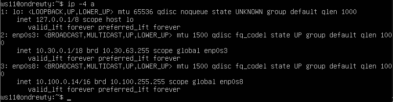
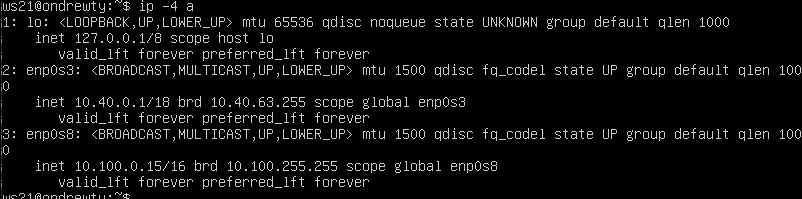


---

### 5.3 IP forwarding yoqish
**Izoh:** r1 va r2 routerlarda marshrutlash yoqildi.
```bash
sudo sysctl -w net.ipv4.ip_forward=1
# doimiy uchun
echo "net.ipv4.ip_forward=1" | sudo tee -a /etc/sysctl.conf
sudo sysctl -p
```
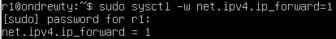
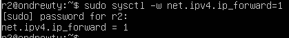
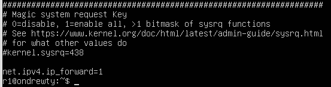
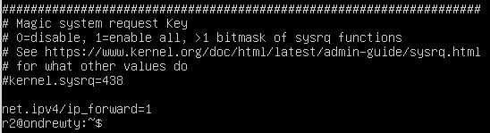

---

### 5.4 Statik marshrutlar va monitoring
**Izoh:** Routerlarda statik marshrutlar va tcpdump natijalari.
```
enp0s8:
  addresses: [10.100.0.11/16]
  routes:
    - to: 10.20.0.0/26
      via: 10.100.0.12
```
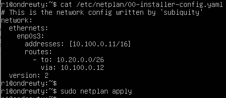
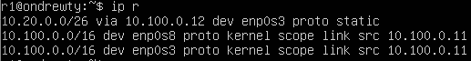
```bash
sudo tcpdump -tnv -i enp0s3
```
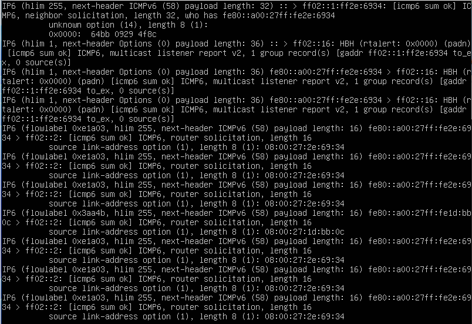

---

### 5.5 Ping, traceroute va ICMP testlari
**Izoh:** Mashinalar o‘rtasida bog‘lanish va ICMP paketlar yo‘nalishi tahlili.
```bash
traceroute <ws21_ip>
```

```bash
# r1 da:
sudo tcpdump -n -i eth0 icmp

# ws11 da:
ping -c 1 10.30.0.111
```


---

## Part 6. DHCP konfiguratsiyasi

### 6.1 DHCP server sozlanishi
**Izoh:** r2 da dhcpd.conf fayli sozlandi.
```
default-lease-time 600;
max-lease-time 7200;
authoritative;

subnet 10.100.0.0 netmask 255.255.0.0 {
  range 10.100.1.2 10.100.1.200;
  option routers 10.100.0.12;
  option domain-name-servers 8.8.8.8;
}
subnet 10.20.0.0 netmask 255.255.255.192 {
  range 10.20.0.2 10.20.0.50;
  option routers 10.20.0.1;
  option domain-name-servers 10.20.0.1;
}
```


---

### 6.2 DNS sozlamasi
**Izoh:** resolv.conf faylida DNS server belgilandi.
```bash
echo "nameserver 8.8.8.8" | sudo tee /etc/resolv.conf
```


---

### 6.3 DHCP testlari
**Izoh:** Server qayta ishga tushirildi, mijozlar IP olishni muvaffaqiyatli amalga oshirdi.
```bash
sudo systemctl restart isc-dhcp-server
# client (ws21) da
sudo netplan apply   # agar dhcp4: true belgilangan bo'lsa
ip a                 # IP olganini tekshirish
```


```
ethernets:
  eth0:
    macaddress: 10:10:10:10:10:BA
    dhcp4: true
```


---

## Part 7. NAT (SNAT / DNAT) va Apache

### 7.1 Apache sozlamalari
**Izoh:** Apache har xil mashinalarda tinglash manzili o‘zgartirildi.ws22 va r1 da: /etc/apache2/ports.conf faylida
`Listen 0.0.0.0:80`


---

### 7.2 r2 da NAT sozlamalari
**Izoh:** SNAT va DNAT qoidalari iptables orqali sozlandi.
```
#!/bin/sh
iptables -F
iptables -t nat -F

iptables --policy FORWARD DROP

# 4) ruxsat bering - barcha ICMPni yoqish (misol)
iptables -A FORWARD -p icmp -j ACCEPT

# 5) SNAT (outgoing masklash) - tarmoq 10.20.0.0/26 uchun
iptables -t nat -A POSTROUTING -s 10.20.0.0/26 -o eth0 -j MASQUERADE
# yoki SNAT misol:
# iptables -t nat -A POSTROUTING -s 10.20.0.0/26 -o eth0 -j SNAT --to-source <r2_public_ip>

# 6) DNAT: r2:8080 -> ws22:80
iptables -t nat -A PREROUTING -p tcp --dport 8080 -j DNAT --to-destination 10.20.X.Y:80
iptables -A FORWARD -p tcp -d 10.20.X.Y --dport 80 -j ACCEPT
```


---

### 7.3 SNAT/DNAT testlari
**Izoh:** Trafik yo‘nalishi va port o‘tkazilishi tekshirildi.
```bash
telnet <r1_ip> 80
```

```bash
telnet <r2_ip> 8080
```


---

## Part 8. SSH Tunnels

### 8.1 Apache faqat localhostda tinglash
**Izoh:** Apache faqat 127.0.0.1 manzilida ishlashi sinovdan o‘tkazildi.`Listen 127.0.0.1:80`


---

### 8.2 Lokal tunnel (ws21 → ws22)
**Izoh:** ssh -L tunneli orqali masofaviy Apache’ga ulanildi.
```bash
ssh -L 8080:127.0.0.1:80 student@ws22
# keyin boshqa terminalda:
telnet 127.0.0.1 8080
# yoki curl:
curl http://127.0.0.1:8080
```


---

### 8.3 Reverse tunnel (ws11 → ws22)
**Izoh:** ssh -R tunneli orqali server tomondan ulanish amalga oshirildi.
```bash
# ws11 dan
ssh -R 9090:127.0.0.1:80 student@ws22
# keyin ws22 (yoki server) da:
telnet 127.0.0.1 9090
```


---

## Xulosa

- ipcalc yordamida tarmoq diapazonlari va niqoblar tahlil qilindi.  
- Netplan bilan statik IP va marshrutlar o‘rnatildi.  
- iperf3 yordamida tarmoq tezligi o‘lchandi.  
- iptables asosida firewall, NAT, DNAT sozlandi.  
- DHCP server ishlatilib, mijozlarga avtomatik IP berildi.  
- SSH tunnel yordamida xavfsiz port yo‘naltirish bajarildi.  
